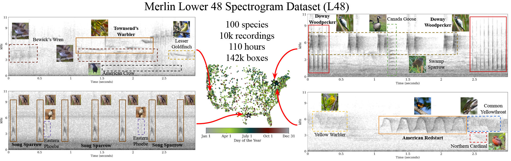
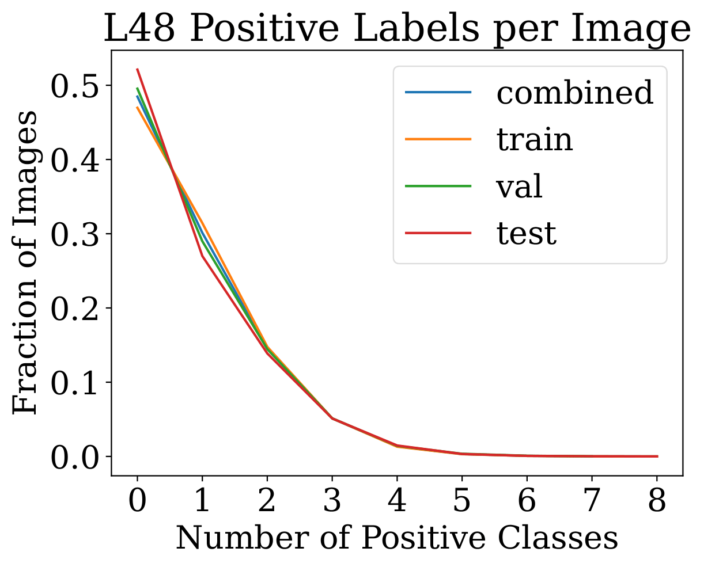
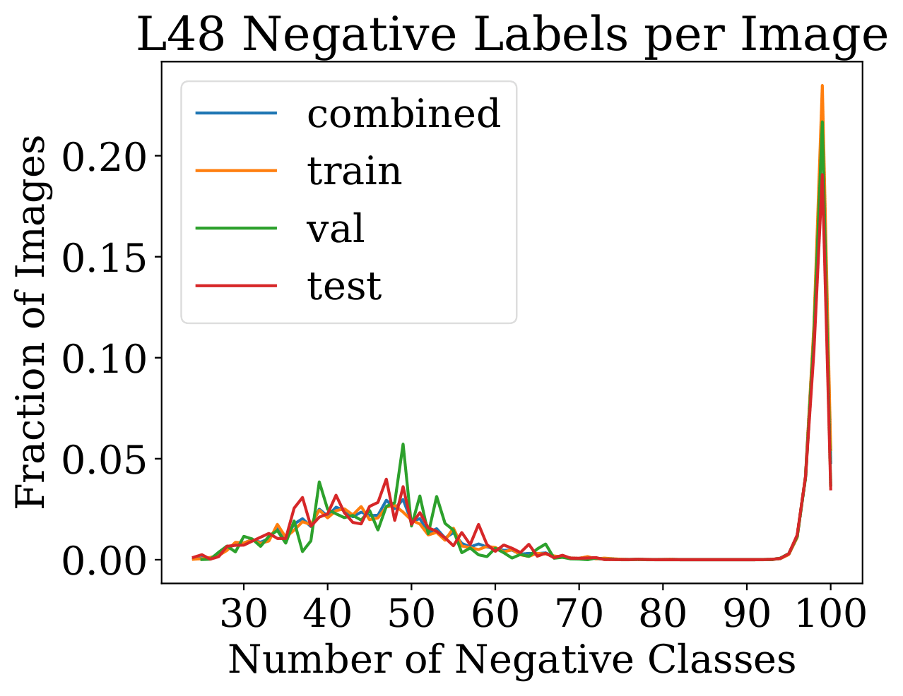
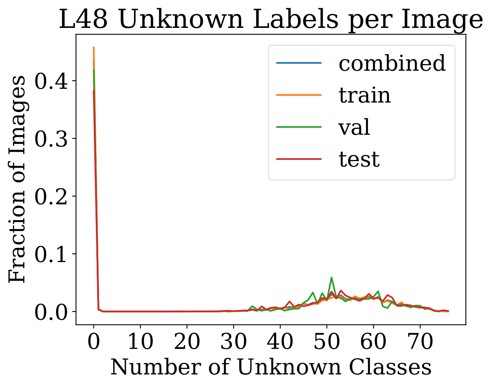

# The Merlin L48 Spectrogram Dataset (L48)

<p align="center">
  
  <br>
  <em>Figure 1: The Merlin L48 Spectrogram (L48) dataset spans the Lower 48 states of the US with bird recordings throughout the year. Each recording is associated with a target species (solid) but also contains background species (dashed), giving rise to a natural single-positive, multi-label (SPML) task. L48 stands out among similar datasets as being at country-wide, year-round scale while still maintaining high-quality bounding box annotations.</em>
</p>

[NeurIPS25](https://openreview.net/forum?id=6hY4hBL8M6) [arXiv](https://arxiv.org/abs/2511.00252) [Code](https://github.com/cvl-umass/l48-benchmarking)

## Data Download

The data can be downloaded [here](https://msid-ml48s.s3.amazonaws.com/v0/ml48s.tar.gz). For information about the data format, see the [dataset organization section](#organization).

## Terms of Use
By downloading this dataset you agree to terms in [TOU.pdf](./TOU.pdf)

## Dataset Details
| Split  | \# Images | + (min) | + (max) | + (avg) | + (med) | - (min) | - (max) | - (avg) | - (med) |
| :---   | :---      | :---    | :---    | :---    | :---    | :---    | :---    | :---    | :---    |
| Train  | 85193     | 0       | 8       | 0.84    | 1       | 24      | 100     | 69.59   | 59      |
| Train+ | 45178     | 1       | 8       | 1.58    | 1       | 24      | 99      | 85.33   | 98      |
| Val    | 12448     | 0       | 7       | 0.81    | 1       | 25      | 100     | 67.72   | 53      |
| Test   | 31365     | 0       | 8       | 0.78    | 0       | 24      | 100     | 68.73   | 53      |
| **Total**  | 129006    | 0       | 8       | 0.82    | 1       | 24      | 100     | 68.47   | 56      |

An overview of positive and negative labels in terms of minimum per image, maximum per image, average, and median for training, validation, and testing splits as well as all three splits combined. "+" signifies the number of positive labels and "-" signifies the number of negative labels. "Train+" signifies the training set with images with at least one positive.

<table>
  <tr>
    <td></td>
    <td></td>
    <td></td>
  </tr>
</table>

| Known Labels     | # Images | % Images |
| :--------------- | :------: | :------: |
| Fully-labeled    |  38,975  |  45.75%  |
| At least one box |  45,178  |  53.03%  |
| Any labels       |  85,193  |   100%   |

Training set annotation breakdown.

## Evaluation

We evaluate at the 3-second-window level, meaning each image in the test set is evaluated separately. Our primary metric is mean average precision (mAP): mAP: AP is computed for each class separately and then averaged. We evaluate on fully-annotated images in the test set only. We recommend using [sklearn](https://scikit-learn.org/stable/modules/generated/sklearn.metrics.average_precision_score.html) to calculate this score. 

## <a name="organization"></a> Dataset Organization (Modified from Appendix A.2)

We organize the ML48S by images in sets which come from recordings, which we also call clips (`clips.json`) and assets (`assets.json`), respectively. 

### Image Directories
Each asset has its own directory where each clip is enumerated sequentially in time. The overall structure of the images is `images/[asset_id]/[clip_num].jpg`.

### Asset Metadata

Each asset has associated metadata which we summarize in the table and also explain in detail below.

```
{
  "id": int,
  "split": str,
  "target_species_code": str,
  "possible_species_codes": [str],
  "observed_species_codes": [str],
  "present_species_codes": [str],
  "unknown_species_codes": [str],
  "absent_species_codes": [str]
}
```

| Field                    | Possible Values   | Description                                       |
| ------------------------ | ----------------- | ------------------------------------------------- |
| `id`                     | \[0, 9999]        | The unique ID associated with the asset           |
| `split`                  | train, test       | Denotes training split or test split for an asset |
| `target_species_code`    | 6-letter-code     | The target species for this asset                 |
| `possible_species_codes` | \[6-letter-codes] | A list of possible species based on ranges        |
| `observed_species_codes` | \[6-letter-codes] | A list of species in the affiliated checklist     |
| `present_species_codes`  | \[6-letter-codes] | A list of positively labeled species              |
| `unknown_species_codes`  | \[6-letter-codes] | All species not in present or absent lists        |
| `absent_species_codes`   | \[6-letter-codes] | A list of negatively labeled species              |

Each asset is associated with a unique asset ID from 0 to 9999. Assets with an ID greater than or equal to 8000 are test assets, and each species has 80 training assets and 20 test assets. For our experiments, we randomly selected 10 training assets per species to serve as validation assets for hyperparameter tuning. Each asset contains a variable number of clips, with a minimum of 11 and a maximum of 1450. As discussed in the paper, every asset has a target species which is provided in the form of a 6-character target species code. The corresponding taxonomic information such as phylogeny, common name, and scientific name are given in `taxa.csv`.

Assets also contain compiled lists of positives, negatives, and unknowns, where positives are also known as present species and negatives are also known as absent species. The list of positives is the union of positives given across each clip in the asset, while the list of negatives is the intersection of clip negatives. The list of unknowns is the species which are not in either of the previous two lists.

Assets also contain two additional fields, possible species given by geographic priors and observed species within the associated checklist. Using the location and time of year each recording was taken, we are able to generate a list of possible species based on species ranges. Though this list does not provide positive labels, absence of a species on this list implies a negative label for that species across the entire recording. This logic also applies for observed species within the associated checklist. Any species present in the recording should also be reported in the associated checklist, so species not on the checklist should have negative labels for the recording. The negative labels generated through checklist data is a superset of the negative labels generated from geographical priors. Hence, geographical priors and checklist data provide two additional levels of weak supervision which falls between SPML and full-labels. We apply negative labels from geographical and range priors to the clip level, even for unlabeled data.

### Clip Metadata

```
{
  "id": int,
  "asset_id": int,
  "clip_order": int,
  "file_path": str,
  "width": int,
  "height": int,
  "present_species_codes": [str],
  "unknown_species_codes": [str],
  "absent_species_codes": [str],
  "boxes": [box]
}

box{
  "id": int,
  "species_code": str,
  "status": str,
  "bbox": [float]
}
```

| Field                   | Possible Values   | Description                                            |
| ----------------------- | ----------------- | ------------------------------------------------------ |
| `id`                    | \[0, 416534]      | The unique ID associated with the clip                 |
| `asset_id`              | \[0, 9999]        | The asset ID from which this clip came                 |
| `clip_order`            | \[0, 1449]        | The position of the clip within the asset              |
| `file_path`             | Relative filepath | The path to the image for the given clip               |
| `width`                 | 750               | The image width                                        |
| `height`                | 236               | The image height                                       |
| `present_species_codes` | \[6-letter-codes] | A list species with positive labels                    |
| `unknown_species_codes` | \[6-letter-codes] | All species not in present or absent lists             |
| `absent_species_codes`  | \[6-letter-codes] | A list species with negative labels                    |
| `boxes`                 | \[dictionaries]   | Bounding box annotations for the clip (see next table) |

Clips also have corresponding metadata which is summarized in the table above. The bounding box annotations for each clip are provided, where each box is specified with an ID, species code, status, and coordinates. The box ID is unique to a clip, so no two boxes within the same clip share the same ID. The bounding box coordinates are given in relative coordinates falling within \[0, 1] and are provided as `[xmin, ymin, xmax, ymax]`. For box status, sounds which are longer than 80 ms which are only present in the first or last 200 ms of a window are labeled `"ignore"` while others are `"active"`.

Boxes which do not have status `"ignore"` are treated as positive labels for the multi-label task and are given in the list of positives. Any clip with positive labels is treated as fully-labeled, meaning all other species are negative, unless there are `"Unknown bird"` boxes, in which case we treat other possible species as unknown (but retain negatives from geographical priors).
Box metadata is given in detail below:

| Field          | Possible Values                     | Description                                    |
| -------------- | ----------------------------------- | ---------------------------------------------- |
| `id`           | int                                 | Box ID unique to each clip                     |
| `species_code` | 6-letter-code                       | The species which this vocalization belongs to |
| `status`       | `"passive"`, `"active"`, `"ignore"` | Species prevalence in the clip                 |
| `bbox`         | `[0, 1]^4`                          | Box coordinates `[xmin, ymin, xmax, ymax]`     |

## Pre-trained Models and Training Code

For SPML pretrained models and training code, see https://github.com/cvl-umass/l48-benchmarking. 

## Citation
```
@inproceedings{sunmerlin,
   title={Merlin L48 Spectrogram Dataset},
   author={Sun, Aaron and Maji, Subhransu and Van Horn, Grant},
   booktitle={The Thirty-ninth Annual Conference on Neural Information Processing Systems Datasets and Benchmarks Track}
}
```
